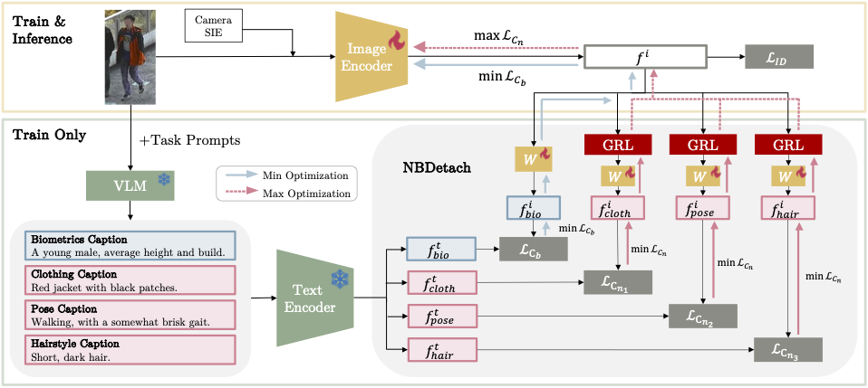

# DIFFER: Disentangling Identity Features via Semantic Cues for Clothes-Changing Person Re-ID

This repository contains PyTorch implementation for CVPR 2025 paper: **DIFFER: Disentangling Identity Features via Semantic Cues for Clothes-Changing Person Re-ID**.  

[🔗 Paper Link (arXiv)](https://arxiv.org/abs/2503.22912)



## Abstract

Clothes-changing person re-identification (CC-ReID) aims to recognize individuals under different clothing scenarios. Current CC-ReID approaches either concentrate on modeling body shape using additional modalities including silhouette, pose, and body mesh, potentially causing the model to overlook other critical biometric traits such as gender, age, and style, or they incorporate supervision through additional labels that the model tries to disregard or emphasize, such as clothing or personal attributes. However, these annotations are discrete in nature and do not capture comprehensive descriptions.
In this work, we propose DIFFER: Disentangle Identity Features From Entangled Representations, a novel adversarial learning method that leverages textual descriptions to disentangle identity features. Recognizing that image features inherently mix inseparable information, DIFFER introduces NBDetach, a mechanism designed for feature disentanglement by leveraging the separable nature of text descriptions as supervision. It partitions the feature space into distinct subspaces and, through gradient reversal layers, effectively separates identity-related features from non-biometric features. We evaluate DIFFER on 4 different benchmark datasets (LTCC, PRCC, CelebreID-Light, and CCVID) to demonstrate its effectiveness and provide state-of-the-art performance across all the benchmarks. DIFFER consistently outperforms the baseline method, with improvements in top-1 accuracy of 3.6% on LTCC, 3.4% on PRCC, 2.5% on CelebReID-Light, and 1% on CCVID.


## Installation

```bash
# Install Python 3.11 (if not already installed)
# Then install dependencies
pip install torch>=2.0
pip install -r requirements.txt
````


## Training & Evaluation

1. Generate or download the **textual features** (will upload soon), and place them in a directory with the following structure:

```
TextCaptionDirectory/
├── Dataset1/
│   ├── TextEncoderModelVersion/
│   │   └── train.npz
│   └── train_caption_summary_biometric.json
├── Dataset2/
│   └── ...
```

* `train_caption_summary_biometric.json` contains all the summarized biometric information and its corresponding textual encodings.

2, To train the model:
```bash
CUDA_VISIBLE_DEVICES=0,1 python -m torch.distributed.launch --nproc_per_node=2 --master_port $PORTNUM train.py  \
--jobId 1 \
--loss "ce,triplet,clipBio,clipBioReverse"  \
--config_file 'configs/ltcc/eva02_l_bio.yml' \
MODEL.DIST_TRAIN True \
OUTPUT_NAME "DIFFER" \
DATA.CAPTION_DIR "/TextCaptionDirectory/LTCC_ReID" \
DATA.ROOT "/DatasetsDirectory"
```

3, To evaluate the model,

```bash
CUDA_VISIBLE_DEVICES=0 python -m torch.distributed.launch --nproc_per_node=1 --master_port 6673 test.py \
--config_file 'MODELDIR/config.yml' \
TEST.WEIGHT 'MODELDIR/eva02_l_bio_best.pth' 

```

## Code Acknowledgment

Our implementation is based on [MADE](https://github.com/moon-wh/MADE.git). We reuse parts of their code and build upon it for our method. We thank the authors for their excellent work.

## Citation

If you find this work helpful, please cite:

```bibtex
@InProceedings{Liang_2025_CVPR,
    author    = {Liang, Xin and Rawat, Yogesh S},
    title     = {DIFFER: Disentangling Identity Features via Semantic Cues for Clothes-Changing Person Re-ID},
    booktitle = {Proceedings of the Computer Vision and Pattern Recognition Conference (CVPR)},
    month     = {June},
    year      = {2025},
    pages     = {13980-13989}
}
```